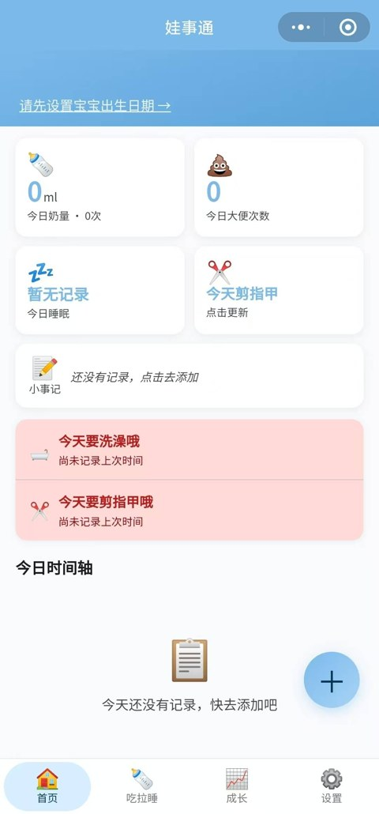

# Baby Daily Logger Agent Skill

用自然语言记录宝宝起居，并兼容娃事通微信小程序。

Natural-language baby daily logging, compatible with the Washitong / 娃事通 WeChat mini-program JSON format.


## What it does / 它能做什么

You say one short sentence. The skill turns it into structured baby daily records.

你说一句话，它把内容转成结构化宝宝起居记录。

Examples:

- `刚刚喝了120奶`
- `10点20睡着了，11点05醒了`
- `刚刚拉屎了，是稀的`
- `今天第一次吃了南瓜泥`

Supported records / 支持记录：

- Milk / 喂奶
- Poop / 大便
- Sleep / 睡眠
- Weight and height / 体重和身高
- Solid food / 辅食
- Notes / 小事记录
- Bath and nail trimming / 洗澡、剪指甲

It can also:

- Ask follow-up questions when information is missing.
- Summarize a day.
- Export JSON that can be imported by 娃事通.
- Import existing 娃事通-compatible JSON.
- Draw simple charts for milk, growth, and sleep.

## 娃事通兼容 / Washitong compatible

This skill is not a replacement for the mini-program. It is a natural-language input layer for agents.

这个 skill 不是替代小程序，而是给 Agent 用的自然语言录入层。

You can keep using 娃事通 as the mobile UI, and use an agent to write or export compatible JSON.

你仍然可以用娃事通作为手机端界面，同时用 Agent 记录并导出兼容 JSON。



## Use with agent systems / 接入 Agent 系统

This repo is designed to be used by agent systems such as OpenClaw, Claude Code, MCP-based agents, or your own tool-calling runtime.

这个仓库适合接入 OpenClaw、Claude Code、基于 MCP 的 Agent，或你自己的 tool-calling 运行时。

Agent-facing instructions are in `SKILL.md`.

Agent 使用说明在 `SKILL.md`。

Typical workflow:

1. User says: `刚刚喝了120奶`.
2. Agent parses it without writing.
3. Agent asks the user to confirm.
4. Agent writes the structured record.
5. User can query summaries, draw charts, or export JSON for 娃事通.

## Install / 安装

```bash
pip install -e .
```

For charts / 如需绘图：

```bash
pip install -e '.[visualization]'
```

## Quick use / 快速使用

Parse only, do not write / 只解析，不写入：

```bash
baby-daily-logger parse '刚刚喝了120奶'
```

Write a record / 写入记录：

```bash
baby-daily-logger --workspace ./demo record '刚刚喝了120奶'
```

Show today's summary / 查询今天总结：

```bash
baby-daily-logger --workspace ./demo summary today
```

Export JSON for 娃事通 / 导出娃事通兼容 JSON：

```bash
baby-daily-logger --workspace ./demo export --output baby_data_export.json
```

Import JSON / 导入 JSON：

```bash
baby-daily-logger --workspace ./demo import baby_data_export.json
```

Draw a chart / 绘图：

```bash
baby-daily-logger --workspace ./demo visualize milk_daily_totals --days 30
```
