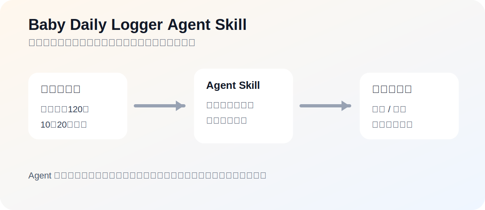

# Baby Daily Logger Agent Skill

用自然语言记录宝宝起居，并兼容娃事通微信小程序。

Natural-language baby daily logging, compatible with the Washitong / 娃事通 WeChat mini-program JSON format.



## What it does / 它能做什么

You say one short sentence. The skill turns it into structured baby daily records.

你说一句话，它把内容转成结构化宝宝起居记录。

Examples:

- `刚刚喝了120奶`
- `10点20睡着了，11点05醒了`
- `刚刚拉屎了，是稀的`
- `今天第一次吃了南瓜泥`

Supported records / 支持记录：

- Milk / 喂奶
- Poop / 大便
- Sleep / 睡眠
- Weight and height / 体重和身高
- Solid food / 辅食
- Notes / 小事记录
- Bath and nail trimming / 洗澡、剪指甲

It can also:

- Ask follow-up questions when information is missing.
- Summarize a day.
- Export JSON that can be imported by 娃事通.
- Import existing 娃事通-compatible JSON.
- Draw simple charts for milk, growth, and sleep.

## Install / 安装

```bash
pip install -e .
```

For charts / 如需绘图：

```bash
pip install -e '.[visualization]'
```

## Quick use / 快速使用

Parse only, do not write / 只解析，不写入：

```bash
baby-daily-logger parse '刚刚喝了120奶'
```

Write a record / 写入记录：

```bash
baby-daily-logger --workspace ./demo record '刚刚喝了120奶'
```

Show today's summary / 查询今天总结：

```bash
baby-daily-logger --workspace ./demo summary today
```

Export JSON for 娃事通 / 导出娃事通兼容 JSON：

```bash
baby-daily-logger --workspace ./demo export --output baby_data_export.json
```

Import JSON / 导入 JSON：

```bash
baby-daily-logger --workspace ./demo import baby_data_export.json
```

Draw a chart / 绘图：

```bash
baby-daily-logger --workspace ./demo visualize milk_daily_totals --days 30
```

## Data location / 数据位置

By default, data is stored under the selected workspace:

默认数据保存在所选 workspace 下：

```text
data/baby_everythings/baby_data.json
```

The `data/` directory is ignored by git.

`data/` 默认不会被 git 提交。

## Files / 文件说明

- `SKILL.md`: instructions for agents. Agent 使用说明。
- `SCHEMA.md`: JSON schema compatible with 娃事通. 兼容格式说明。
- `baby_daily_logger/cli.py`: command line interface. 命令行入口。
- `baby_daily_logger/adapters/simple_tools.py`: simple Python functions for agent hosts. 给 Agent 宿主封装工具用。
- `baby_daily_logger/core/parser.py`: natural-language parser. 自然语言解析。
- `baby_daily_logger/core/storage.py`: JSON storage, import, export. 数据读写和导入导出。
- `baby_daily_logger/core/summary.py`: daily summary. 每日总结。
- `baby_daily_logger/core/visualization.py`: chart logic. 图表逻辑。
- `examples/demo_baby_data.json`: synthetic demo data. 匿名示例数据。

## Privacy / 隐私

Baby records are private family data. Do not publish real exported JSON, baby names, birth dates, screenshots, bot tokens, mini-program IDs, or cloud environment IDs.

宝宝起居记录是家庭隐私。不要公开真实导出 JSON、宝宝姓名、出生日期、聊天截图、机器人 token、小程序 ID 或云环境 ID。
